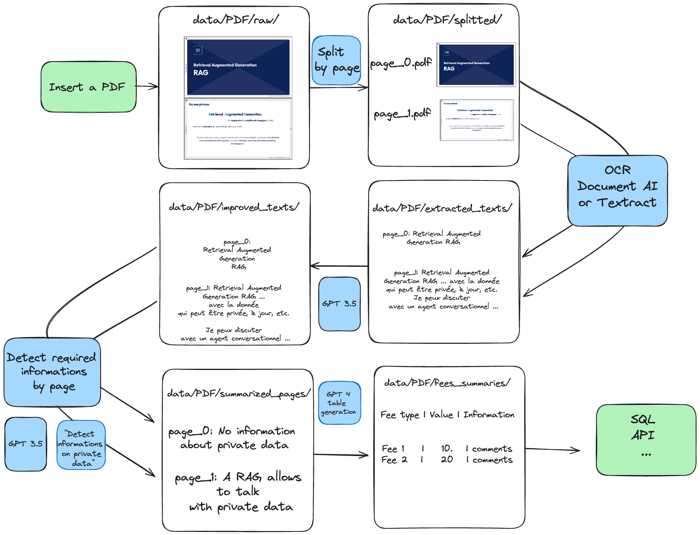

# OCR-LLM

OCR-LLM extracts texts from PDFs using Document AI, fix bad structure extraction using GPT 4 and answer informations on text using GPT 4.

## How it works
The app uses the Google Cloud Document AI to extract the text from the PDFs. Then, it uses GPT 4 to fix the structure of the text and answer questions about the text.



## Prerequisites
- Poetry
- A GCP account with the Document AI API enabled and a [Document AI processor](https://cloud.google.com/document-ai?hl=en) created
```bash
poetry init # init poetry with the default settings
poetry lock --no-update # lock the dependencies
poetry shell # emulate the created environment
poetry run python -m ipykernel install --user --name .ocr # Add the environment to jupyter if you try the tutorials
```

## Use
Try the Streamlit app:
```python
poetry run streamlit run app.py
```